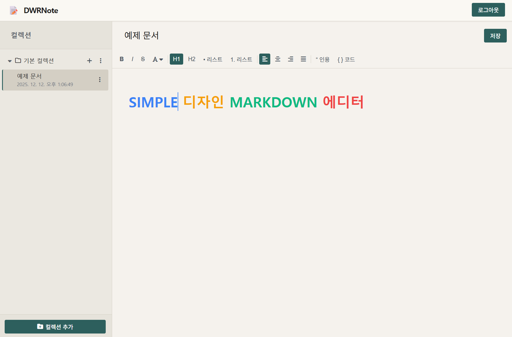

# DWRNote

셀프 호스팅 가능한 간단한 웹 기반 노트 앱 프로젝트

---


## 개요

DWRNote는 Node.js(Express)와 MySQL, Tiptap 기반의 단일 사용자용 노트 웹 애플리케이션 입니다.  기존의 마크다운 기반 노트앱과 유사한 블록 기반 문서 편집 인터페이스와 간단한 페이지 관리 기능을 구현하기 위한 개인 프로젝트 입니다.

---

## 주요 기능

### 페이지 관리

- 페이지 목록 조회
- 새 페이지 생성
- 페이지 제목/본문 수정
- 페이지 삭제
- 최근 수정 시각 기준 정렬
- 초기 실행 시 `pages` 테이블이 비어 있으면 기본 페이지 1개를 자동 생성

### 편집기 기능

Tiptap v2 및 StarterKit을 기반으로 하는 마크다운 편집기이며. 주요 기능은 다음과 같습니다.

- 블록 유형
  - 기본 문단
  - 제목 블록 (H1, H2)
  - 글머리 기호 목록 (bullet list)
  - 번호 목록 (ordered list)
  - 인용구 (blockquote)
  - 코드 블록 (code block)
  - 구분선(horizontal rule, 슬래시 명령 등을 통해 삽입)

- 인라인 서식
  - 굵게 (bold)
  - 기울임 (italic)
  - 취소선 (strike)
  - 텍스트 색상 변경 (몇 가지 고정 색상 프리셋)

- 문단 정렬
  - 왼쪽 정렬
  - 가운데 정렬
  - 오른쪽 정렬
  - 양쪽 정렬

- 편의 기능
  - `/` 입력을 기반으로 하는 슬래시 메뉴를 통한 블록 타입 전환
  - 툴바 버튼으로 블록/서식 토글
  - `Ctrl+S` / `Cmd+S` 단축키를 통한 저장

---

## 기술 스택

- 런타임
  - Node.js (버전 18 이상 권장)
  - MySQL (일반적인 MySQL 8.x 환경을 가정)

- 서버 측
  - Express 5.x
  - mysql2 (promise 기반)

- 클라이언트 측
  - 순수 HTML/CSS/JavaScript
  - Tiptap v2 (StarterKit, TextAlign, Color, TextStyle)
  - `tiptap-for-browser` 번들 (CDN)
  - Font Awesome (아이콘, CDN)

---

## 디자인 컨셉

DWRNote는 **한지로 쓰인 저승노트**라는 컨셉으로 한국 전통의 초자연적 느낌을 살린 디자인을 적용하고 있습니다.

### 색상 팔레트

- **배경색**: 한지 느낌의 크림/베이지 계열 (#faf8f3, #f5f2ed)
  - 눈의 피로를 줄이고 장시간 노트 작성에 최적화된 따뜻한 색감

- **사이드바**: 어두운 베이지 계열 (#ebe8e1, #e6e3db)
  - 차분하고 깊이감 있는 톤으로 콘텐츠와 시각적 구분

- **텍스트**: 먹색 계열 (#1a1a1a, #2d2d2d)
  - 한지 위에 먹으로 쓴 듯한 선명하고 읽기 좋은 대비

- **포인트 컬러**: 어두운 청록색 (#2d5f5d, #1e4d4a)
  - 밤/저승의 신비로운 분위기를 표현하는 차가운 색조

- **회색 톤**: (#5a6169, #6b7280)
  - 은은하고 절제된 보조 색상

### 디자인 특징

1. **한국식 미니멀리즘**
   - 불필요한 장식을 배제한 깔끔한 여백
   - 직선 위주의 디자인 (border-radius 3px로 최소화)

2. **한지 스타일 배경**
   - 따뜻한 베이지/크림 톤의 배경으로 전통 한지 느낌 재현
   - 부드럽고 자연스러운 색감으로 눈의 피로 최소화

3. **절제된 그림자**
   - 약한 box-shadow로 깊이감만 표현
   - 과도한 장식 없는 깔끔한 레이아웃

4. **여백의 미**
   - 충분한 패딩과 line-height (1.7)로 가독성 향상
   - 블록 간 적절한 간격으로 편안한 읽기 경험 제공

5. **초자연적 요소**
   - 어두운 청록색 액센트 컬러로 저승/영혼의 색 표현
   - 회색조 전반으로 무채색의 신비로운 세계 분위기
   - 선택된 항목의 왼쪽 보더로 영혼의 표식 시각화

---

## 디렉터리 구조

루트 디렉터리 기준 주요 파일 및 디렉터리는 다음과 같습니다.

- `server.js`  
  Express 서버 엔트리 포인트입니다.
  - MySQL 커넥션 풀 초기화
  - `pages` 테이블 생성 및 기본 페이지 삽입
  - `/api/*` REST 엔드포인트 정의
  - 정적 파일 서빙 (`public` 디렉터리)

- `public/`
  - `index.html`  
    단일 페이지 애플리케이션의 HTML 템플릿입니다. 사이드바, 에디터 영역, 툴바 등을 포함합니다.
  - `app.js`  
    클라이언트 로직입니다.
    - Tiptap 에디터 초기화
    - 툴바, 슬래시 메뉴, 페이지 목록, 새 페이지/저장/삭제 버튼 이벤트 처리
    - `/api/pages` 계열 엔드포인트와의 통신
  - `styles.css`  
    레이아웃 및 스타일 정의입니다.
    - 헤더, 사이드바, 에디터 영역
    - 툴바 버튼, 색상 드롭다운, 슬래시 메뉴 스타일

- `package.json`, `package-lock.json`  
  Node.js 의존성 및 스크립트 정의입니다.

- `node_modules/`  
  Node.js 의존성 디렉터리입니다. 일반적인 환경에서는 `npm install`을 통해 재구성할 수 있습니다.

---

## 설치 및 실행

### 1. 사전 요구 사항

- Node.js 18 LTS 이상
- MySQL 서버 인스턴스
- 터미널 및 Node.js 패키지 관리 도구(npm)

### 2. 데이터베이스 준비

MySQL에 접속하여 데이터베이스를 생성합니다.

```sql
CREATE DATABASE dwrnote
  CHARACTER SET utf8mb4
  COLLATE utf8mb4_unicode_ci;
```
데이터베이스 이름은 기본값(dwrnote)을 기준으로 작성하였습니다. 다른 이름을 사용할 경우 환경 변수 또는 server.js 내 DB_CONFIG를 함께 수정해야 합니다.

### 3. 환경 설정

서버는 다음과 같은 환경 변수를 사용합니다. 설정되지 않은 값은 server.js 내 기본값을 사용합니다.

* DB_HOST (기본값: localhost)
* DB_PORT (기본값: 3306)
* DB_USER (기본값: root)
* DB_PASSWORD (기본값: admin)
* DB_NAME (기본값: dwrnote)
* PORT (기본값: 3000)

예시
```
export DB_HOST=localhost
export DB_PORT=3306
export DB_USER=your_user
export DB_PASSWORD=your_password
export DB_NAME=dwrnote
export PORT=3000
```

또는 환경 변수 대신 server.js의 DB_CONFIG 객체를 직접 수정해도 됩니다.

### 4. 의존성 설치
```
npm install
```

이미 node_modules 디렉터리가 포함된 상태라면 생략 가능하나, 일반적인 환경에서는 npm install을 통해 정리하는 것이 안전합니다.

### 5. 서버 실행
```
npm start
```

서버가 정상적으로 기동되면 콘솔에 다음과 같은 로그가 출력됩니다.
```
DWRNote 앱이 http://서버주소:3000 에서 실행 중.
```